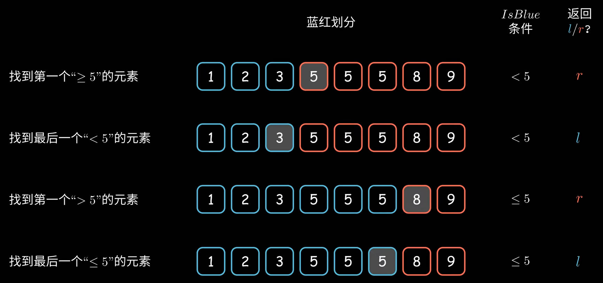

# 数组

## 二分查找

二分是在有序数组或者有序区间上查找的高效算法。可以采用红蓝边界法求解，基本思想为：

- 根据查找元素，将数组/区间分为两部分（红蓝区间）。
- 判断 mid 元素是否为蓝色，更新红蓝区间
- 根据题意最终返回红蓝边界

需要在查找前判断若 `a[0] > x || a[n - 1] < x`，则直接返回 `-1`；假设存在序列 `[1,4,6,7,8]`，查找元素为 `0`。初始 `l = -1, r = 5, mid = 2`，`q[mid]` 永远大于 x，故 `l` 不会更新，会发生数组越界，所以要提前处理。其中 L 永远指向蓝色区间，R 永远指向红色区间，所以初始化时 `l = -1, r = n`。

<figure markdown=span>  </figure>

**算法模板**

```C++
int find(int a[], int n, int x)
{
    if(a[0] > x || a[n - 1] < x)
        return -1;
    int l = -1, r = n;  //
    while(l + 1 != r)
    {
        int mid = (l + r) / 2;
        if(IsBlue(mid)) l = mid;
        else r = mid;
    }
    return l or r;
}
```

### [二分查找](https://leetcode.cn/problems/binary-search/description/)

```C++
class Solution {
public:
    int search(vector<int>& nums, int target) {
        int n = nums.size() - 1;
        if(nums[0] > target || nums[n] < target)
            return -1;
        int l = -1, r = n + 1;
        while(l + 1 != r)
        {
            int mid = (l + r) / 2;
            if(nums[mid] <  target) l = mid;
            else r = mid;
        }
        if(nums[r] == target) return r;
        else return -1;
    }
};
```

### [搜索插入位置](https://leetcode.cn/problems/search-insert-position/description/)

```C++
class Solution {
public:
    int searchInsert(vector<int>& nums, int x) {
        int n = nums.size() - 1;
        if(nums[0] > x) return 0;
        if(nums[n] < x) return n + 1;
        int l = -1, r = n + 1;
        while(l + 1 != r)
        {
            int mid = (l + r) / 2;
            if(nums[mid] < x) l = mid;
            else r = mid;
        }
        return r;
    }
};
```

### [在排序数组中查找元素的第一个和最后一个位置](https://leetcode.cn/problems/find-first-and-last-position-of-element-in-sorted-array/)

```C++
class Solution {
public:
    int find1(vector<int>& a, int x)
    {
        int n = a.size();
        int l = -1, r = n;
        while(l + 1 != r)
        {
            int mid = (l + r) / 2;
            if(a[mid] < x)
                l = mid;
            else
                r = mid;
        }
        return r;
    }
    int find2(vector<int>& a, int x)
    {
        int n = a.size();
    int l = -1, r = n;
    while(l + 1 != r)
    {
        int mid = (l + r) / 2;
        if(a[mid] <= x)
            l = mid;
        else
            r = mid;
    }
    return l;
    }
    vector<int> searchRange(vector<int>& nums, int x) {
        int n = nums.size() - 1;
        if(n < 0 || nums[0] > x || nums[n] < x)
            return vector<int> {-1,-1};
        int res1 = find1(nums, x);
        int res2 = find2(nums,x);
        if(nums[res1] != x)
            return vector<int> {-1,-1};
        return vector<int>{res1, res2};


        
    }
};
```

### [x 的平方根 ](https://leetcode.cn/problems/sqrtx/description/)

```C++
class Solution {
public:
    int mySqrt(int x) {
        if(x == 0) return 0;
        if(x == 1) return 1;
        int l = -1, r = x;
        while (l + 1 != r)
        {
            long long mid = (l + r) / 2;
            if (mid * mid <= x)
                l = mid;
            else
                r = mid;
        }
        return l;
    }
};
```

## 移除元素

### [删除有序数组中的重复项](https://leetcode.cn/problems/remove-duplicates-from-sorted-array/description/)

!!! note
    - 初始化 `k = 1`，表示保留元素要填入的下标。
    - 从 `i = 1` 开始遍历。
    - 如果 `nums[i] == nums[i - 1]`，则 `nums[i]` 是重复项，不保留。
    - 如果 `nums[i] != nums[i - 1]`，则 `nums[i]` 不是重复项，保留，填入 `nums[k]` 中，然后 k++。
    - 遍历结束后，k 就是 nums 中的唯一元素的数量

```C++
class Solution {
public:
    int removeDuplicates(vector<int>& nums) {
        int k = 1;
        for(int i = 1; i < nums.size(); i ++)
        {
            if(nums[i] != nums[i - 1])
                nums[k ++] = nums[i];
        }
        return k;
    }
};
```

### [移动零](https://leetcode.cn/problems/move-zeroes/description/)

!!! note
    从左到右遍历 `nums[i]`，同时维护另一个下标 $i_0$，保证下标区间 $[i_0,i-1]$ 都是 0，且把 $i_0$ 指向最左边的 $0$。
    每次遇到 $nums[i] != 0$ 的情况，就把 $nums[i]$ 与 $nums[i_0]$ 交换。交换后 $i_0$ 和 $i$ 都加一，$[i_0,i-1]$ 都是 0 这一性质仍然成立。

```C++
class Solution {
public:
    void moveZeroes(vector<int>& nums) {
        int i0 = 0;
        for(int i = 0; i < nums.size(); i ++)
        {
            if(nums[i] != 0)
            {    
                swap(nums[i], nums[i0]);
                i0 ++;
            }
        }
    }
};
```

### [有序数组的平方](https://leetcode.cn/problems/squares-of-a-sorted-array/description/)

!!! note
    1. 初始化长为 $n$ 的数组 $ans$。
    2. 左指针$i=0$，右指针$j=n-1$。初始化下标$p=n-1$，表示向$ans[p]$填入数据
    3. 设$x=nums[i]^2,y=nums[j]^2$
    4. 若$x>y$，将$x$填入$ans[p]$，反之将$y$填入$ans[p]$

```C++
class Solution {
public:
    vector<int> sortedSquares(vector<int>& nums) {
        int n = nums.size();
        vector<int> ans(n);
        int i = 0, j = n - 1;
        for(int p = n - 1; p >= 0; p --)
        {
            // int x = nums[i] * nums[i];
            // int y = nums[j] * nums[j];
            int x = nums[i], y = nums[j];
            if(-x > y)
            {
                ans[p] = x * x;
                i ++;
            }
            else
            {
                ans[p] = y * y;
                j --;
            }
        }
        return ans;
    }
};
```