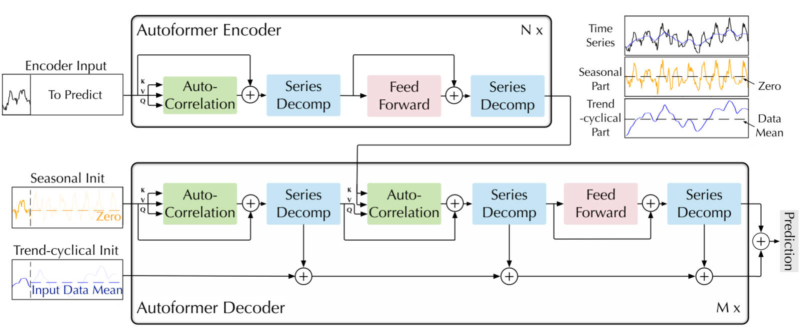
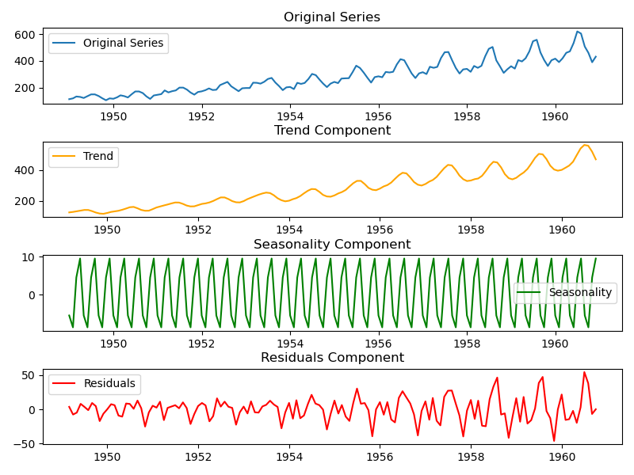
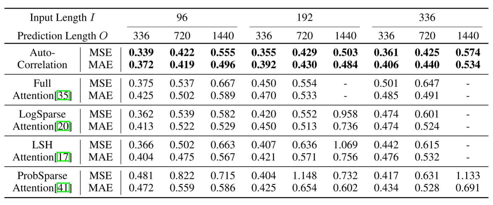
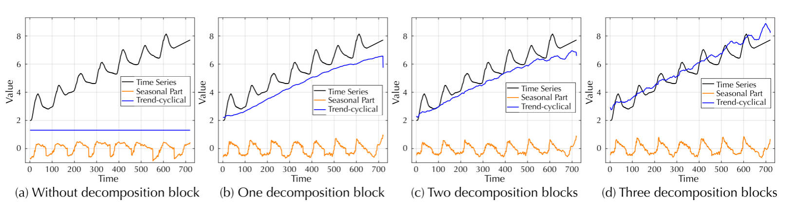
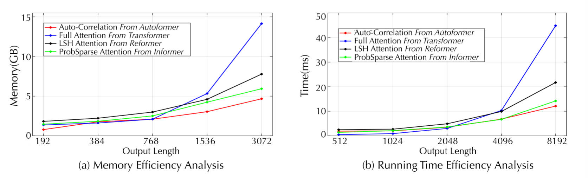

# Autoformer

在时间序列分析中，**逐点连接（point-wise connection）** 通常指的是模型在每个时间步对当前时刻的特征进行处理时，只考虑该时刻与其他时刻之间的局部或直接联系，而不考虑全局或长期依赖关系。这种连接方式常见于自注意力机制中的 逐点表示聚合，也就是说，模型在进行时间序列建模时，对于每一个时间步，它仅仅利用该时间步的特征与其他少量的时间步的特征进行相互作用。

逐点连接的特点：

- 局部性：逐点连接通常依赖于时间步之间的局部相互关系。例如，在自注意力机制中，逐点连接可能仅聚焦于当前时间步与前几个时间步、后几个时间步之间的关系，忽略了长时间跨度的依赖。

- 稀疏性：随着序列长度的增加，逐点连接通常会采取稀疏策略，降低计算复杂度。这种稀疏连接常常意味着只关注某些关键点或距离较近的时间步之间的关系。

- 信息局限性：尽管逐点连接在计算上比较高效，但它在长期依赖关系的捕捉上可能存在局限性。尤其是在涉及到周期性模式或复杂时间模式的任务中，逐点连接可能无法充分捕捉到跨越长时间段的深层次依赖关系。

在长期时间序列预测中，逐点连接的局限性可以通过以下方式进行改进：

- 周期性依赖：通过考虑时间序列的周期性特征，在自注意力机制中引入更为灵活的连接方式。比如，模型可以通过周期性的特征来构建新的连接规则，不仅仅关注局部的时间步，而是通过周期性捕捉更广泛的时间依赖。

- 序列级别的连接：可以通过分解策略，将时间序列分为多个子序列（例如周期性子序列），并在不同子序列之间建立连接，这样模型不仅能够捕捉到局部的依赖，还能在较长时间跨度上发现潜在的依赖关系。

- 全局注意力机制：例如，全局自注意力（global self-attention）模型能够同时关注长时间跨度内的所有时间步，使得模型在计算时能够综合考虑长距离的时间依赖，解决逐点连接无法捕捉到长期依赖的问题。

## 解决问题：长期时间序列预测

长期时间序列预测问题：待预测的序列长度远大于输入长度，即基于有限的信息预测更长远的未来。

|   |  基于 transformer 的预测模型 |  Autoformer  |
|---|---|---|
| 应对复杂时间模式  | 难以直接发现可靠的时间依赖  |  深度分解架构  |
| 长序列高效处理  | 稀疏注意力机制导致信息利用瓶颈  |  自相关机制  |

## Autoformer 创新点

- 突破将序列分解作为预处理的传统方法，提出深度分解架构，能够从复杂时间模式中分解出可预测性更强的组成部分。
- 基于随机过程理论，提出自相关机制，代替逐点链接的注意力机制。实现序列级（series-wise）连接和 $O(LlogL)$ 复杂度。

## Autoformer 架构

<figure markdown=span></figure>

## 深度分解架构

时间序列分解旨在将一个复杂的时间序列分解为多个相对简单的组成部分, 以便更好地理解其特征和规律。通常包括：

- 趋势：表示时间序列数据中长期的上升或下降趋势。
- 季节性：表示数据中周期性重复的模式，通常与季节、月份或一周中的特定时间有关。
- 残差：表示时间序列中无法由趋势和季节性模式解释的随机波动。

<figure markdown=span>  </figure>

常用分解方法为加法分解：$Y_t = T_t + S_t + R_t$。由于预测问题中未来的不确定性，通常先对过去序列进行分解，再分别预测。但这会造成预测结果受限于分解效果，并忽视了未来各个组成部分之间的相互作用。

本文提出深度分解架构，将序列分解作为模型的一个内部单元，嵌入到编-解码器中。在预测过程中，模型交替进行预测结果的优化和序列分解，即从隐变量中逐步分离趋势项与周期项，实现渐进式分解。

本文将序列分解为趋势项和季节项，采用 AvgPool 进行移动平均，并进行填充操作以保持序列长度不变。（AvgPool 是一种下采样方法，用于平滑序列，从而提取长期趋势）

$$
\begin{array}{l}
\mathcal{X}_{\mathrm{t}}=\operatorname{AvgPool}(\operatorname{Padding}(\mathcal{X})) \\
\mathcal{X}_{\mathrm{s}}=\mathcal{X}-\mathcal{X}_{\mathrm{t}},
\end{array}
$$

## Encoder

编码器的输入是过去 I 个时间的步长。解码器的输入是使用编码器输入的后一半，并将其分解为趋势项和季节项。

$$
\begin{aligned}
\mathcal{X}_{\text {ens }}, \mathcal{X}_{\text {ent }} & =\operatorname{SeriesDecomp}\left(\mathcal{X}_{\mathrm{en} \frac{I}{2}: I}\right) \\
\mathcal{X}_{\text {des }} & =\operatorname{Concat}\left(\mathcal{X}_{\mathrm{ens}}, \mathcal{X}_{0}\right) \\
\mathcal{X}_{\text {det }} & =\operatorname{Concat}\left(\mathcal{X}_{\mathrm{ent}}, \mathcal{X}_{\mathrm{Mean}}\right)
\end{aligned}
$$

Encoder 主要关注季节项部分，假设有 N 层编码器，第 I 层编码器层：$\mathcal{X}_{\mathrm{en}}^{l}=\operatorname{Encoder}\left(\mathcal{X}_{\mathrm{en}}^{l-1}\right) .$，具体有：

$$
\begin{array}{l}
\mathcal{S}_{\mathrm{en}}^{l, 1},_{-}=\operatorname{SeriesDecomp}\left(\text { Auto-Correlation }\left(\mathcal{X}_{\mathrm{en}}^{l-1}\right)+\mathcal{X}_{\mathrm{en}}^{l-1}\right) \\
\mathcal{S}_{\mathrm{en}}^{l, 2},_{-}=\operatorname{SeriesDecomp}\left(\operatorname{FeedForward}\left(\mathcal{S}_{\mathrm{en}}^{l, 1}\right)+\mathcal{S}_{\mathrm{en}}^{l, 1}\right),
\end{array}
$$

Encoder 部分主要目的是对序列的季节项进行建模。通过多层的 Series Decomposition Block 不断从原始序列中提取季节项，最终会指导 Decoder 在未来预测季节项的信息。 

## Decoder

Decoder 包含两部分，用于趋势成分的累计结构和用于季节成分的堆叠自相关机制。

假设解码器有 $M$ 层，编码器的输出为 $X^N_{en}$，则第I层的解码器输出为$X^i_{de}=Decoder(X^{i-1}_{de},X^N_{en})$。

第I层处理流程为：

$$
\begin{aligned}
\mathcal{S}_{\mathrm{de}}^{l, 1}, \mathcal{T}_{\mathrm{de}}^{l, 1} & =\operatorname{SeriesDecomp}\left(\text { Auto-Correlation }\left(\mathcal{X}_{\mathrm{de}}^{l-1}\right)+\mathcal{X}_{\mathrm{de}}^{l-1}\right) \\
\mathcal{S}_{\mathrm{de}}^{l, 2}, \mathcal{T}_{\mathrm{de}}^{l, 2} & =\operatorname{SeriesDecomp}\left(\text { Auto-Correlation }\left(\mathcal{S}_{\mathrm{de}}^{l, 1}, \mathcal{X}_{\mathrm{en}}^{N}\right)+\mathcal{S}_{\mathrm{de}}^{l, 1}\right) \\
\mathcal{S}_{\mathrm{de}}^{l, 3}, \mathcal{T}_{\mathrm{de}}^{l, 3} & =\operatorname{SeriesDecomp}\left(\text { FeedForward }\left(\mathcal{S}_{\mathrm{de}}^{l, 2}\right)+\mathcal{S}_{\mathrm{de}}^{l, 2}\right) \\
\mathcal{T}_{\mathrm{de}}^{l} & =\mathcal{T}_{\mathrm{de}}^{l-1}+\mathcal{W}_{l, 1} * \mathcal{T}_{\mathrm{de}}^{l, 1}+\mathcal{W}_{l, 2} * \mathcal{T}_{\mathrm{de}}^{l, 2}+\mathcal{W}_{l, 3} * \mathcal{T}_{\mathrm{de}}^{l, 3},
\end{aligned}
$$

- 内部自相关与序列分解，将上一层输出作为输入，应用自相关机制，然后做残差连接。
- 编码器-解码器自相关与序列分解。
- 前馈网络与序列分解：前馈网络用于进一步处理和提取特征。
- 趋势累计:$T_{d e}^{l}=T_{d e}^{l-1}+W_{l, 1} * T_{d e, 1}^{l}+W_{l, 2} * T_{d e, 2}^{l}+W_{l, 3} * T_{d e, 3}^{l}$

最终预测结果为$Ws * X^M_{de} + W_T * T^M_{de}$。

## 模型分析

将Auto-Correlation与self-attention family做对比，当序列很长的时候，Autoformer能够有更好的memory efficiency。另外，随着输入长度增大，输出不变时，MSE也增大，可能过久的历史数据被当作了噪声。

<figure markdown=span></figure>

随着序列分解单元的数量增加，模型学到的趋势项会越来越接近真实结果，这验证了渐进式分解的作用。

<figure markdown=span></figure>

在显存占用和运行时间两个指标上，自相关机制均表现出了优秀的空间时间效率，两个层面均超过自注意力机制，表现出高效的复杂度。

<figure markdown=span></figure>