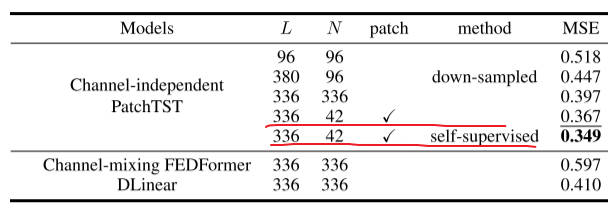
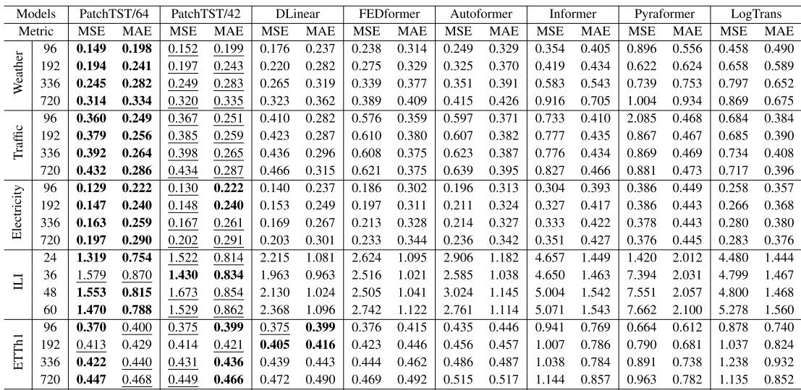
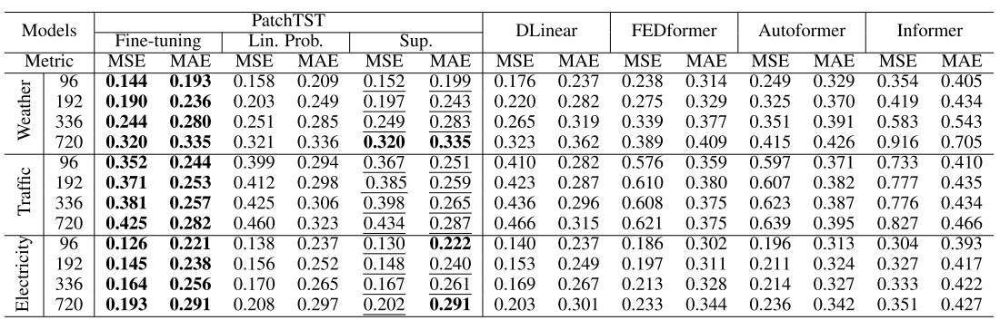
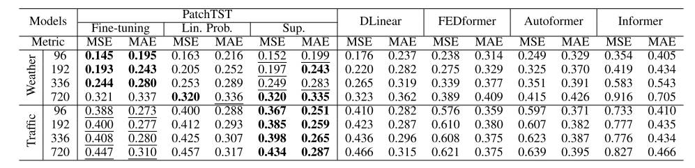
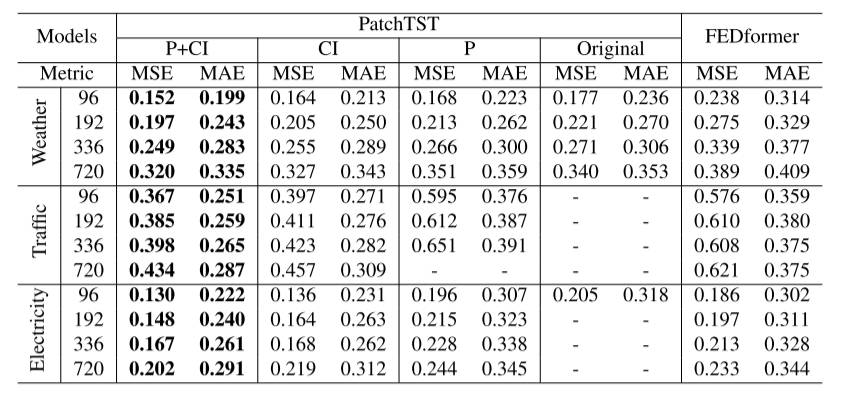
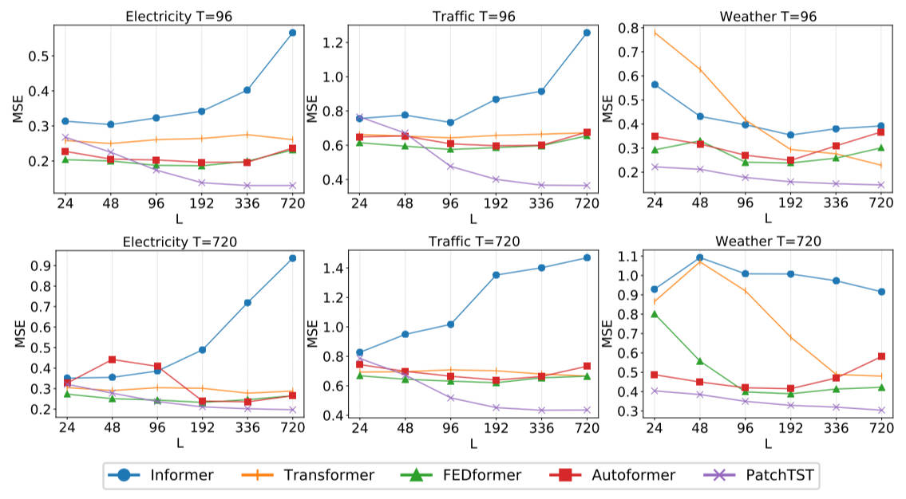
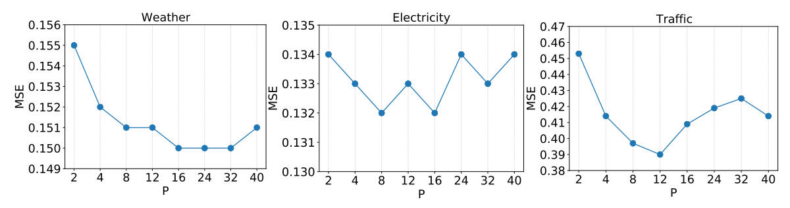

# PatchTST

## 问题描述

基于 Transformer 的预测模型

- 多变量时序预测
- 自监督表示学习

channel-independence patch time series Transformer(PatchTST)

- 将时间步聚合为子序列级别的 Patch
- 通道独立：每个通道包含单个特征的时间序列

模型优势

- 时间和空间复杂度的降低：$N=L \to N \approx \frac{L}{s}$
- 可以关注更长的历史序列
- 表示学习的能力：捕获数据的抽象表示

<figure markdown=span>  </figure>

## 模型实现

<figure markdown=span> .jpg)</figure>

<figure markdown=span> .jpg)</figure>

关键参数

- Patch 长度（P）
- Stride 步长（S）：patch 可以重叠或非重叠
- Token 个数（N）：$N=\left\lfloor\frac{(L-P)}{S}\right\rfloor+2$

## 表示学习

**预训练辅助任务**

- 将每个输入序列划分为不重叠的 patch
- 随机掩码，遮蔽数据块
- 重建被掩码的 patch

**解决两个问题**

- 掩盖数据点，插值导致模型无法学习到重要的抽象表示

## 实验 1：长时预测

回望窗口：Autoformer，FEDformer，Informer，L = [24,48,96,192,336,720] 选最佳，DLinear：L = 336

PatchTST：p = 16，s = 8；PatchTST/64：L = 512, N = 64；PatchTST/42：L = 336，N = 42

<figure markdown=span>  </figure>

## 实验 2：表示学习-预测任务

Patch 不重叠，L = 512，P = 12，掩码率 40%

<figure markdown=span>  </figure>

在电力数据集上做预训练，在其他数据集上微调

<figure markdown=span></figure>

## 消融实验

CI：只有通道独立；P：只有patch

<figure markdown=span></figure>

<figure markdown=span></figure>

本文patch长度设定为16

<figure markdown=span></figure>