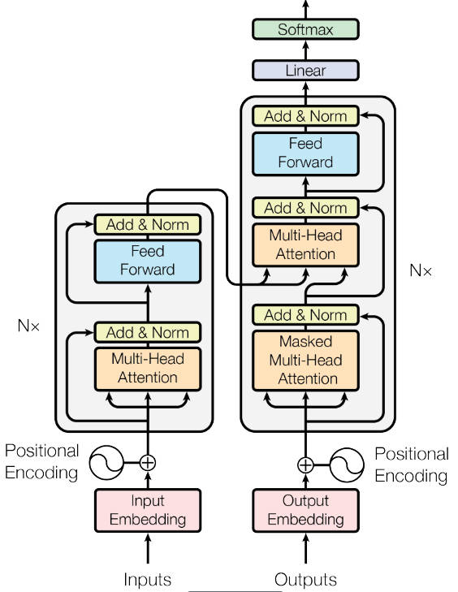

# Transformer

transformer 是完全依赖于自注意力机制来计算输入和输出表示的转换模型，而不使用序列对齐的 RNN 或卷积。

## 模型架构

大多数转义模型采用编码器结构。编码器将输入序列 $(x_1,...,x_n)$ 映射为连续的 $\mathbf{z}=\left(z_{1}, \ldots, z_{n}\right)$。给定 $\mathbf{z}$，解码器随后依次生成输出序列 $(y_1,...,y_m)$。每一步，模型都是自回归的，将上一步的输出作为下一步的输入。

Transformer 也遵循这种整体架构，编码器和解码器均使用堆叠的自注意力层和逐点全连接层，如图所示。

## 编码器

编码器由多个相同的层叠加而成，每个层有 2 个子层。第一个子层是多头子注意力汇聚。第二个子层是基于位置前馈网络。每个子层都采用了残差连接，并且在 Transformer 中，对于序列中任何输入 x，需保证子层的输出和输入维度相同，以便进行残差连接计算。紧接着应用层归一化。因此，输入序列对应的每个位置，Transformer 编码器都将输出一个 d 维表示向量。

## 解码器

解码器也由多个相同的层叠加而成。相较于编码器，解码器插入了第三个子层，称为编码器 － 解码器注意力层。在该层中，查询来自前一个解码器层的输出，而键和值来自整个编码器的输出。在解码器自注意力中，查询、键和值都来自上一个解码器层的输出。但是，解码器中的每个位置只能考虑该位置之前的所有位置。

### 层归一化

时间序列任务中，通常处理的是一个单独的序列样本，而不是一组不同的样本。同时，时间序列模型的输入样本通常是时序相关的，且同一序列内的关系更为重要，故不使用批归一化，因为不同时间步的数据不该进行归一化。

即批归一化是对一个批次中的所有样本的同一特征进行归一化，通常适用于 CNN 中；层归一化是对单个样本的所有特征进行归一化，不依赖于批次大小，能够很好处理变化的输入。

### 基于位置的前馈网络

基于位置是指前馈网络的计算在每个序列位置上是逐个进行的，且这些运算相互独立，不会考虑其他位置的输入。具体流程为：

$$
FFN(h_i​)= ReLU(W_1​h_i​+b_1​)W_2​+b_2​
$$

