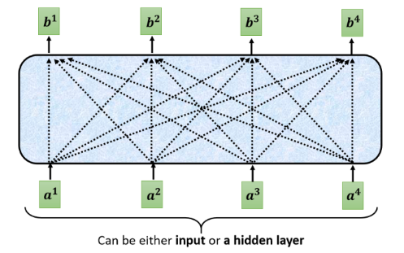

# Transformer

Transformer 是完全依赖于自注意力机制来计算输入和输出表示的转换模型，而不使用序列对齐的 RNN 或卷积。

## 模型架构

大多数转义模型采用 Encoder 结构。Encoder 将输入序列 $(x_1,...,x_n)$ 映射为连续的 $\mathbf{z}=\left(z_{1}, \ldots, z_{n}\right)$。给定 $\mathbf{z}$，Decoder 随后依次生成输出序列 $(y_1,...,y_m)$。每一步，模型都是自回归的，将上一步的输出作为下一步的输入。

Transformer 也遵循这种整体架构，Encoder 和 Decoder 均使用堆叠的自注意力层和逐点全连接层，如图所示。

## Self-Attention

自注意力机制的核心在于，对于一个序列中的每个位置，它根据其他位置的信息来重新表示自己，从而捕捉到序列中不同位置之间的依赖关系。这使得模型能够关注到当前元素与序列中其他元素之间的关系，而不仅仅是前后邻近的元素。输出重新表示了序列中的每个元素，在原有特征的基础上，结合了该元素与序列中其他元素的关系信息。

注意力函数可以描述为将查询和一组键值对映射到输出，其中查询、键、值和输出都是向量。输出是值的加权和，其中分配给每个值的权重是通过查询与相应键的兼容性函数计算得出的。

$$
\operatorname{Attention}(Q, K, V)=\operatorname{softmax}\left(\frac{Q K^{T}}{\sqrt{d_{k}}}\right) V
$$

## Encoder 结构

Encoder 由 6 个相同的层叠加而成，每个层有 2 个子层。第一个子层是 MultiHeadAttention。第二个子层是 Feed Forward。每个子层都采用了残差连接，并且在 Transformer 中，对于序列中任何输入 x，需保证子层的输出和输入维度相同，以便进行残差连接计算。紧接着应用 LayerNorm。因此，输入序列对应的每个位置，Transformer Encoder 都将输出一个 d 维表示向量。故第一个层输入为序列的表示向量矩阵，后续层的输入为上一层的输出，最后一层输出的矩阵就是编码信息矩阵，后续会用到 Decoder 中。

### Add&Norm

该层由残差连接和层归一化两部分组成，计算公式如下。其中 X 表示多头注意力或者 Feed Forward 的输入，MultiHeadAttention(X)和 FeedForward(X)表示输出。

第一个子层为：

$$
LayerNorm(X + MultiHeadAttention(X))
$$

第二个子层为：

$$
LayerNorm(X + FeedForward(X))
$$

Add 为残差连接，通常用于解决多层网络训练的问题，让网络只关注当前差异的部分；Norm 指 LayerNorm，通常用于 RNN 结构。

- 时间序列任务中，通常处理的是一个单独的序列样本，而不是一组不同的样本。同时，时间序列模型的输入样本通常是时序相关的，且同一序列内的关系更为重要，故不使用批归一化，因为不同时间步的数据不该进行归一化。
- 即批归一化是对一个批次中的所有样本的同一特征进行归一化，通常适用于 CNN 中；层归一化是对单个样本的所有特征进行归一化，不依赖于批次大小，能够很好处理变化的输入。

### Feed Forward

基于位置是指前馈网络的计算在每个序列位置上是逐个进行的，且这些运算相互独立，不会考虑其他位置的输入。具体流程为：

$$
FFN(h_i​)= ReLU(W_1​h_i​+b_1​)W_2​+b_2​
$$

## Decoder 结构

Decoder 同样由 N = 6 个相同的层堆叠而成。在每个 Encoder 层的两个子层之外，Decoder 还插入了第三个子层，该子层对 Encoder 堆栈的输出执行多头注意力。与 Encoder 类似，我们在每个子层周围使用残差连接，随后进行层归一化。我们还修改了 Decoder 堆栈中的自注意力子层，以防止位置关注后续位置。这种掩码加上输出嵌入偏移一个位置，确保位置 i 的预测仅依赖于位置小于 i 的已知输出。

### Masked multi-Head Attention

防止模型看到未来信息：在自回归序列生成任务中，当前时刻的输出不能依赖未来时刻的输入。掩码确保了模型在每个时刻只能看到之前的时刻，而不能看到之后的时刻。掩码机制可以表示为：

$$
MaskedAttention(Q, K, V)= softmax(\frac{QK^T}{\sqrt{d^k}}QK^T​+M)V
$$

### 第二个 Multi-Head Attention

Decoder block 第二个 Multi-Head Attention 变化不大， 主要的区别在于其中 Self-Attention 的 K, V 矩阵不是使用 上一个 Decoder block 的输出计算的，而是使用 Encoder 的编码信息矩阵 C 计算的。

这样做的好处是在 Decoder 的时候，每一位单词都可以利用到 Encoder 所有单词的信息 (这些信息无需 Mask)。

## 优势

- 并行处理，Transformer 完全基于自注意力机制，再训练时并行处理出入序列。而 RNN 是逐步处理的。
- Transformer 能够有效捕捉长距离依赖关系，因为自注意力机制可以直接关注到输入序列的任意部分。RNN 随着序列长度增加，早期时刻的消息对后期影响变小，而 CNN 需要层层组合才能获取全局信息。