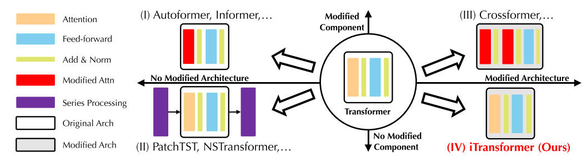
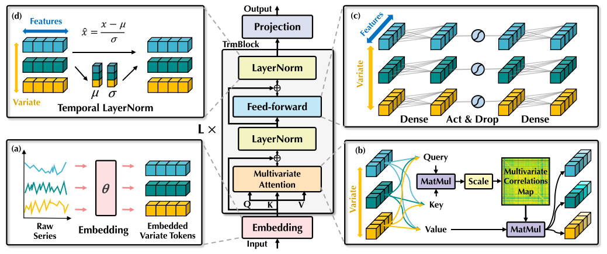
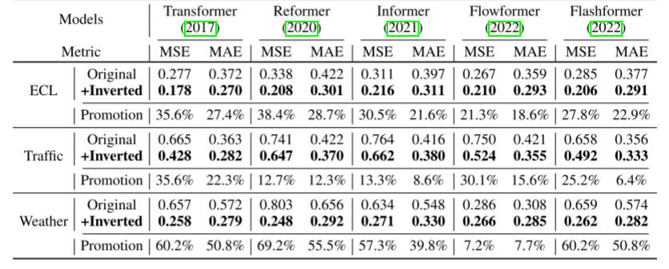

# iTransformer

## 研究问题

**Transformer在时间序列预测中的局限性**：虽然Transformer已经在时间序列预测中取得了一定的成功，但在面对较长回溯窗口时，其性能往往会出现下降，并且计算开销显著增加。此外，Transformer将多个不同的变量（如潜在延迟事件或不同的物理测量）嵌入到同一个时间戳的时间点中，这可能导致无法有效学习变量中心的表示，进而产生无意义的注意力图。

**如何有效利用时间序列的多变量特征**：传统的Transformer模型可能无法处理多变量的时间序列数据，尤其是在每个时间戳包含多个变量的情况下，如何保持这些变量的独立性，并有效捕捉它们之间的相互关系是一个挑战。

**Transformer架构的改进**：在不修改Transformer的基本组件（如注意力机制和前馈网络）的前提下，如何重新组织和应用这些组件，以提升模型在多变量时间序列预测任务中的表现。

## 研究现状

## 创新点

**提出iTransformer模型**：iTransformer通过将每个时间序列视为独立的变量，利用自注意力机制捕捉不同变量之间的相关性。同时，使用层归一化和前馈网络模块来学习全局的时间序列表示。与传统Transformer不同，iTransformer不将多个变量的特征嵌入到同一个时间戳的单一表示中，而是单独处理每个变量，以更好地捕捉它们的相互关系。

## 模型框架

**使用Encoder-Only**

- **简化结构**：传统的Encoder-Decoder结构通常在处理多变量时间序列时需要额外的解码器部分来生成预测结果，这增加了模型的复杂性和计算开销。而iTransformer通过仅使用Encoder部分，简化了模型结构，同时保留了Transformer的核心优势——通过自注意力机制捕捉长时间依赖和多变量之间的相关性。

- **自注意力机制**：在iTransformer中，每个时间序列被视为独立的变量（variate tokens），并通过Encoder部分的自注意力机制来捕捉这些变量之间的多维相关性。由于去除了Decoder部分，模型的计算负担减少，能够更高效地处理长时间序列数据，避免了Transformer在长回溯窗口下的计算爆炸问题。

- **专注于序列表示**：通过只使用Encoder，iTransformer专注于学习输入时间序列的全局表示。这种方法让模型能够通过自注意力机制捕捉到时间序列中的多变量关系，而无需解码器来进行后续的生成任务。

- **提升计算效率和泛化能力**：使用Encoder-only结构使得模型在训练和推理过程中更加高效，同时可以更好地泛化到不同的时间序列任务和不同的回溯窗口上。

在多变量时间序列预测中，给定历史观测值 $X = \{x_1, \dots, x_T\} \in \mathbb{R}^{T \times N}$，其中 T 是时间步长，N 是变量的数量，我们预测未来 S 个时间步的值 $Y = \{x_{T+1}, \dots, x_{T+S}\} \in \mathbb{R}^{S \times N}$。为方便起见，我们将 $X_{t,:}$表示为在时间步 t 同时记录的所有时间点，而 $X_{:,n}$ 表示每个变量 n 的完整时间序列。需要注意的是，$X_{t,:}$中的时间点可能并不反映现实世界中同一事件的时间，因为数据集中的各个变量之间可能存在系统性的时间延迟。此外，$X_{t,:}$中的元素在物理测量和统计分布上可能是不同的，而每个变量 $X_{:,n}$一般共享这些特征。

在iTransformer中，每个特定变量的未来序列预测 $\hat{Y}_{:,n}$,n 是基于回顾序列 $X_{:,n}$简单地表述为如下过程：

$$
\begin{aligned}
\mathbf{h}_{n}^{0} & =\operatorname{Embedding}\left(\mathbf{X}_{:, n}\right), \\
\mathbf{H}^{l+1} & =\operatorname{TrmBlock}\left(\mathbf{H}^{l}\right), l=0, \cdots, L-1, \\
\hat{\mathbf{Y}}_{:, n} & =\operatorname{Projection}\left(\mathbf{h}_{n}^{L}\right),
\end{aligned}
$$

其中 $H = \{h_1, \cdots, h_N\} \in \mathbb{R}^{N \times D}$包含了 N 个维度为 D 的嵌入 token，指数表示层的索引。得到的变量 token 通过自注意力机制相互作用，并在每个 TrmBlock 中由共享的前馈网络独立处理。具体来说，由于序列的顺序隐式地存储在前馈网络神经元的排列中，因此在这里不再需要使用传统 Transformer 中的位置信息编码。

## 实验结果

