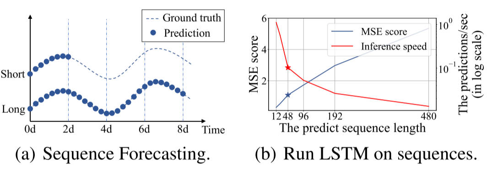
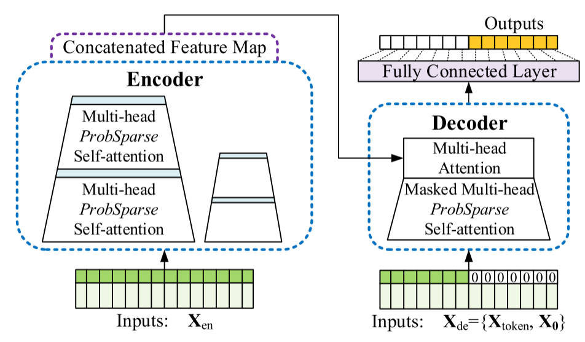
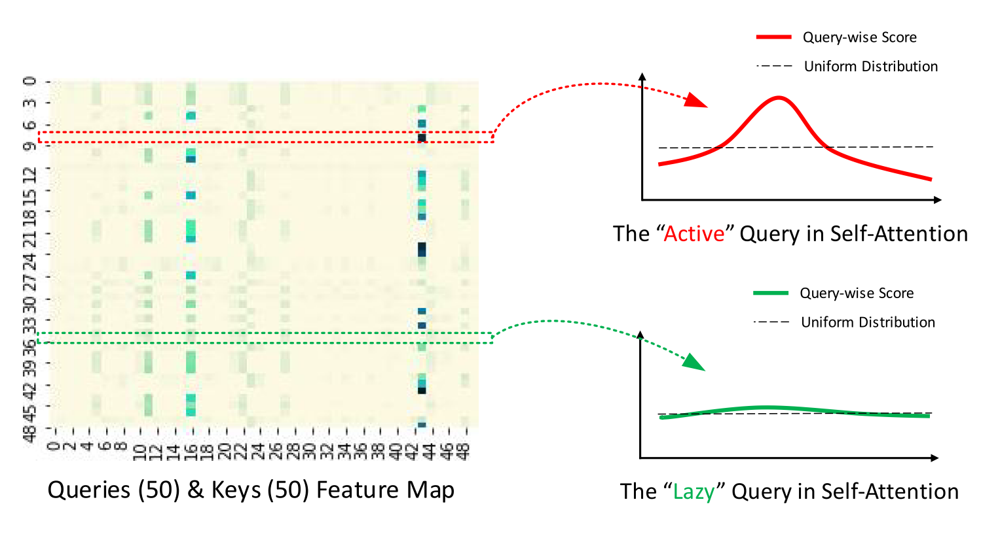
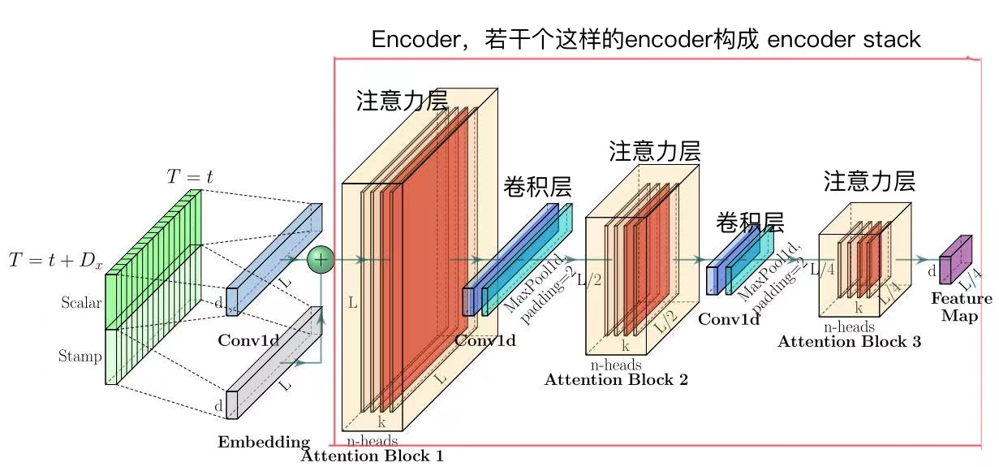
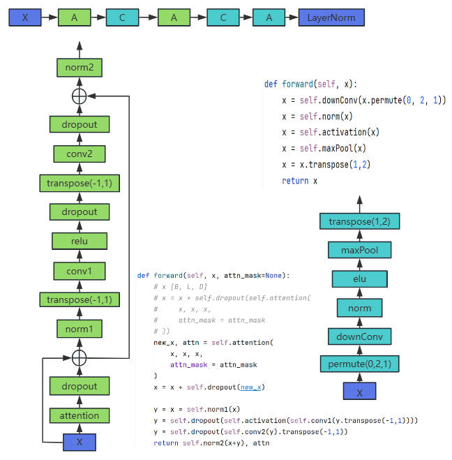

# Informer

## 目前的问题和已有解决方法

Vanilla Transformer 在解决 LSTF 问题时存在三个显著限制：

- Self-Attention 平方级的计算复杂度。
- 堆叠多层网络，内存占用瓶颈。
- step-by-step 解码预测，速度较慢。

有一些关于提高自注意力效率的先前工作：

- Sparse Transformer
- LogSparse Transformer
- Longformer

都使用启发式方法来解决限制 1，并将 Self-Attention 机制的时间复杂度降低到 $O(LlogL)$，但问题在于它们的效率增益是有限的。

## Informer 改进

- 提出 ProbSparse Self-Attention，筛选出最重要的 query，使复杂度降低到 $O(LlogL)$
- 提出 Self-Attention Distilling，减少维度和网络参数量。
- 提出 Generative Style Decoder，一步得到所有预测结果。

左图展示了与短期预测相比，LTSF 可以预测更长的序列；右图表明随着预测序列长度增加，从 $L=48$ 开始，MSE 迅速增大推理速度下降。

<figure markdown=span>  </figure>

## Informer 架构

<figure markdown=span>  </figure>

- Encoder 接受大量长序列输入。模型采用了 ProbSparse Self-Attention 代替了 Transformer 中的 Self-Attention。并且 Encoder 在堆叠时采用了 Self-Attention Distilling。
- Decoder 同样接受长序列输入，预测部分用 0 进行 padding。结果处理后直接输出所有预测结果。

### ProbSparse Self-Attention

传统 Self-Attention 需要 $O(L_QL_K)$ 的内存以及二次点积计算，是其主要缺点。本文研究发现，并不是每个 Q 与 K 之间都有很高的相关性（点积），故只有少数点积对主要注意力计算有贡献，其余可以忽略。

<figure markdown=span>  </figure>

改进算法如下：

- 输入序列长度为 96，首先在 K 中进行采样，随机选取 25 个 K。
- 计算每个 Q 与 25 个 K 的内积。
- 在每个 Q 的 25 个结果中，选择最大值与均值计算差异。
- 将差异从大到小排列，选出差异前 25 大的 Q。
- 其余淘汰的 Q 使用 V 的平均向量进行代替。

### Self-Attention Distilling

<figure markdown=span>  </figure>

## Encoder

<figure markdown=span>  </figure>

下图展示了 EncoderStack 的架构图。一个 EncoderStack 里面包括若干个级联的 Encoder，而一个 Encoder 内部又包括了若干个 EncoderLayer 和 convLayer。其中在 EncoderLayer 内部加入了 ProbSparse Self-Attention。

## Decoder


## 预处理（以 ETTh1 为例）

下图为数据示例，其中每个一小时收集一次变压器的

### Encoder 输入

$X_{enc}=[32,96,7]$，本文使用了 96 个历史样本，其中每个样本有 7 个特征。

$X_{mark}=[32,96,4]$，代表时间信息，将 date 拆分为年、月、日和小时。与上面的 $X_{enc}$ 对应得到所有样本对应的时间戳。

### Decoder 输入

$X_{dec}=[32,72,7]$

$X_{mark}=[32,72,4]$


e_layer = 3

```python
Informer(
  # encoder embedding，编码器端的embedding
  (enc_embedding): DataEmbedding(
    (value_embedding): TokenEmbedding(
      (tokenConv): Conv1d(7, 512, kernel_size=(3,), stride=(1,), padding=(1,), padding_mode=circular)
    )
    (position_embedding): PositionalEmbedding()
    (temporal_embedding): TimeFeatureEmbedding(
      (embed): Linear(in_features=4, out_features=512, bias=True)
    )
    (dropout): Dropout(p=0.05, inplace=False)
  )
  # decoder embedding，解码端的embedding
  (dec_embedding): DataEmbedding(
    (value_embedding): TokenEmbedding(
      (tokenConv): Conv1d(7, 512, kernel_size=(3,), stride=(1,), padding=(1,), padding_mode=circular)
    )
    (position_embedding): PositionalEmbedding()
    (temporal_embedding): TimeFeatureEmbedding(
      (embed): Linear(in_features=4, out_features=512, bias=True)
    )
    (dropout): Dropout(p=0.05, inplace=False)
  )
  # encoder部分
  (encoder): Encoder(
    (attn_layers): ModuleList(
      # 三个包装注意力的encoderlayer，带着conv1/conv2
      (0,1,2): EncoderLayer(
        (attention): AttentionLayer(
          (inner_attention): ProbAttention(
            (dropout): Dropout(p=0.05, inplace=False)
          )
          (query_projection): Linear(in_features=512, out_features=512, bias=True)
          (key_projection): Linear(in_features=512, out_features=512, bias=True)
          (value_projection): Linear(in_features=512, out_features=512, bias=True)
          (out_projection): Linear(in_features=512, out_features=512, bias=True)
        )
        (conv1): Conv1d(512, 2048, kernel_size=(1,), stride=(1,))
        (conv2): Conv1d(2048, 512, kernel_size=(1,), stride=(1,))
        (norm1): LayerNorm((512,), eps=1e-05, elementwise_affine=True)
        (norm2): LayerNorm((512,), eps=1e-05, elementwise_affine=True)
        (dropout): Dropout(p=0.05, inplace=False)
      )
    )
    # 2个卷积层
    (conv_layers): ModuleList(
      (0,1): ConvLayer(
        (downConv): Conv1d(512, 512, kernel_size=(3,), stride=(1,), padding=(1,), padding_mode=circular)
        (norm): BatchNorm1d(512, eps=1e-05, momentum=0.1, affine=True, track_running_stats=True)
        (activation): ELU(alpha=1.0)
        (maxPool): MaxPool1d(kernel_size=3, stride=2, padding=1, dilation=1, ceil_mode=False)
      )
    )
    (norm): LayerNorm((512,), eps=1e-05, elementwise_affine=True)
  )
  (decoder): Decoder(
    (layers): ModuleList(
      (0,1): DecoderLayer(
        (self_attention): AttentionLayer(
          (inner_attention): ProbAttention(
            (dropout): Dropout(p=0.05, inplace=False)
          )
          (query_projection): Linear(in_features=512, out_features=512, bias=True)
          (key_projection): Linear(in_features=512, out_features=512, bias=True)
          (value_projection): Linear(in_features=512, out_features=512, bias=True)
          (out_projection): Linear(in_features=512, out_features=512, bias=True)
        )
        (cross_attention): AttentionLayer(
          (inner_attention): FullAttention(
            (dropout): Dropout(p=0.05, inplace=False)
          )
          (query_projection): Linear(in_features=512, out_features=512, bias=True)
          (key_projection): Linear(in_features=512, out_features=512, bias=True)
          (value_projection): Linear(in_features=512, out_features=512, bias=True)
          (out_projection): Linear(in_features=512, out_features=512, bias=True)
        )
        (conv1): Conv1d(512, 2048, kernel_size=(1,), stride=(1,))
        (conv2): Conv1d(2048, 512, kernel_size=(1,), stride=(1,))
        (norm1): LayerNorm((512,), eps=1e-05, elementwise_affine=True)
        (norm2): LayerNorm((512,), eps=1e-05, elementwise_affine=True)
        (norm3): LayerNorm((512,), eps=1e-05, elementwise_affine=True)
        (dropout): Dropout(p=0.05, inplace=False)
      )
    )
    (norm): LayerNorm((512,), eps=1e-05, elementwise_affine=True)
  )
  (projection): Linear(in_features=512, out_features=7, bias=True)
)
```

Informer forward

```python
def forward(self, x_enc, x_mark_enc, x_dec, x_mark_dec,
                enc_self_mask=None, dec_self_mask=None, dec_enc_mask=None):
        """
        x_enc[32,96,7],x_mark_enc[32,96,4]
        x_dec[32,72,7],x_mark_dec[32,72,4]
        """
        enc_out = self.enc_embedding(x_enc, x_mark_enc)
        # enc_out[32,96,512]
        enc_out, attns = self.encoder(enc_out, attn_mask=enc_self_mask)
        # enc_out[32,24,512]

        dec_out = self.dec_embedding(x_dec, x_mark_dec)
        # dec_out[32,72,512]
        dec_out = self.decoder(dec_out, enc_out, x_mask=dec_self_mask, cross_mask=dec_enc_mask)
        # dec_out[32,72,512]
        dec_out = self.projection(dec_out)
        #dec_out[32,72,7]
        # dec_out = self.end_conv1(dec_out)
        # dec_out = self.end_conv2(dec_out.transpose(2,1)).transpose(1,2)
        if self.output_attention:
            return dec_out[:, -self.pred_len:, :], attns
        else:
            return dec_out[:, -self.pred_len:, :]  # [B, L, D]
```

enc_embedding

```python
def forward(self, x, x_mark):
    #x[32,96,7],x_mark[32,96,4]
    x = self.value_embedding(x) + self.position_embedding(x) + self.temporal_embedding(x_mark)
    """
    value_embedding x[32,96,512]
    position_embedding x[1,96,512]
    temporal_embedding x[32,96,512]
    """
    return self.dropout(x)
#TokenEmbedding
def forward(self, x):
    x = self.tokenConv(x.permute(0, 2, 1)).transpose(1,2)
    #x[32,96,512],permute用于改变张量维度顺序，不改变内容本身
    return x
```

encoder

```python
def forward(self, x, attn_mask=None):
    # x [B, L, D]
    # x = x + self.dropout(self.attention(
    #     x, x, x,
    #     attn_mask = attn_mask
    # ))
    new_x, attn = self.attention(x, x, x,
        attn_mask = attn_mask
    )
    # new_x[32,96,512]
    x = x + self.dropout(new_x)

    y = x = self.norm1(x)
    y = self.dropout(self.activation(self.conv1(y.transpose(-1,1))))
    # conv1: Conv1d(2048,512,kernel_size=(1,),stridf=(1,))
    y = self.dropout(self.conv2(y).transpose(-1,1))
    # conv2: Conv1d(512,2048,kernel_size=(1,),stridf=(1,))
    return self.norm2(x+y), attn
```

Encoder

```python
Encoder(
  (attn_layers): ModuleList(
    (0,1,2): EncoderLayer(
      (attention): AttentionLayer(
        (inner_attention): ProbAttention(
          (dropout): Dropout(p=0.05, inplace=False)
        )
        (query_projection): Linear(in_features=512, out_features=512, bias=True)
        (key_projection): Linear(in_features=512, out_features=512, bias=True)
        (value_projection): Linear(in_features=512, out_features=512, bias=True)
        (out_projection): Linear(in_features=512, out_features=512, bias=True)
      )
      (conv1): Conv1d(512, 2048, kernel_size=(1,), stride=(1,))
      (conv2): Conv1d(2048, 512, kernel_size=(1,), stride=(1,))
      (norm1): LayerNorm((512,), eps=1e-05, elementwise_affine=True)
      (norm2): LayerNorm((512,), eps=1e-05, elementwise_affine=True)
      (dropout): Dropout(p=0.05, inplace=False)
    )
  )
  (conv_layers): ModuleList(
    (0,1): ConvLayer(
      (downConv): Conv1d(512, 512, kernel_size=(3,), stride=(1,), padding=(1,), padding_mode=circular)
      (norm): BatchNorm1d(512, eps=1e-05, momentum=0.1, affine=True, track_running_stats=True)
      (activation): ELU(alpha=1.0)
      (maxPool): MaxPool1d(kernel_size=3, stride=2, padding=1, dilation=1, ceil_mode=False)
    )
  )
  (norm): LayerNorm((512,), eps=1e-05, elementwise_affine=True)
)
```

AttentionLayer

```python
def forward(self, queries, keys, values, attn_mask):
    # shape[queries=keys=values]:[32,96,512]
    B, L, _ = queries.shape # L，S都为96
    _, S, _ = keys.shape
    H = self.n_heads

    # [32,96,512]->[32,96,8,64]
    queries = self.query_projection(queries).view(B, L, H, -1)
    keys = self.key_projection(keys).view(B, S, H, -1)
    values = self.value_projection(values).view(B, S, H, -1)

    out, attn = self.inner_attention(
        queries,
        keys,
        values,
        attn_mask
    )
    if self.mix:
        out = out.transpose(2,1).contiguous()
    out = out.view(B, L, -1)

    return self.out_projection(out), attn
```

```python
def _prob_QK(self, Q, K, sample_k, n_top): # n_top: c*ln(L_q)
    # Q [B, H, L, D][32,8,96,64]
    B, H, L_K, E = K.shape #L_k:96,E:64,B:32,H:8
    _, _, L_Q, _ = Q.shape #L_Q:96

    # calculate the sampled Q_K
    # K_expand[32,8,96,96,64]
    K_expand = K.unsqueeze(-3).expand(B, H, L_Q, L_K, E)
    """
    index_sample[96,25]，torch.randint从[0,24]的范围随机生成整数，用于
    构建形状为[96,25]的张量
    """
    index_sample = torch.randint(L_K, (L_Q, sample_k)) # real U = U_part(factor*ln(L_k))*L_q
    """
    torch.arange(L_Q).unsqueeze(1)生成一个形状为[96,1]的张量，内容为[0,95]构成的序列，加上unsqueeze(1)后，其从形状[96]变为[96,1];
    index_sample是形状为[96,25]的张量，
    """
    K_sample = K_expand[:, :, torch.arange(L_Q).unsqueeze(1), index_sample, :]
    Q_K_sample = torch.matmul(Q.unsqueeze(-2), K_sample.transpose(-2, -1)).squeeze(-2)

    # find the Top_k query with sparisty measurement
    M = Q_K_sample.max(-1)[0] - torch.div(Q_K_sample.sum(-1), L_K)
    M_top = M.topk(n_top, sorted=False)[1]

    # use the reduced Q to calculate Q_K
    Q_reduce = Q[torch.arange(B)[:, None, None],torch.arange(H)[None, :, None],
            M_top, :] # factor*ln(L_q)
    Q_K = torch.matmul(Q_reduce, K.transpose(-2, -1)) # factor*ln(L_q)*L_k

    return Q_K, M_top
```

## Decoder

Decoder 的 Embedding 与 Encoder 的 Embedding 操作完全相同，只是输入变为 `[32,72,7]`

DecoderLayer

```python
def forward(self, x, cross, x_mask=None, cross_mask=None):
  #x[32,72,512], cross[32,24,512]
  x = x + self.dropout(self.self_attention(
      x, x, x,
      attn_mask=x_mask
  )[0])
  x = self.norm1(x)

  x = x + self.dropout(self.cross_attention(
      x, cross, cross,
      attn_mask=cross_mask
  )[0])

  y = x = self.norm2(x)
  #y[32,2048,512]
  y = self.dropout(self.activation(self.conv1(y.transpose(-1,1))))
  # y[32,72,512]
  y = self.dropout(self.conv2(y).transpose(-1,1))

  return self.norm3(x+y)
```

Decoder

```python
def forward(self, x, cross, x_mask=None, cross_mask=None):
  #x[32,72,512], cross[32,24,512]
  for layer in self.layers:
    x = layer(x, cross, x_mask=x_mask, cross_mask=cross_mask)

  if self.norm is not None:
    x = self.norm(x)

  return x
```


```python
(decoder): Decoder(
  (layers): ModuleList(
    (0,1): DecoderLayer(
      (self_attention): AttentionLayer(
        (inner_attention): ProbAttention(
          (dropout): Dropout(p=0.05, inplace=False)
        )
        (query_projection): Linear(in_features=512, out_features=512, bias=True)
        (key_projection): Linear(in_features=512, out_features=512, bias=True)
        (value_projection): Linear(in_features=512, out_features=512, bias=True)
        (out_projection): Linear(in_features=512, out_features=512, bias=True)
      )
      (cross_attention): AttentionLayer(
        (inner_attention): FullAttention(
          (dropout): Dropout(p=0.05, inplace=False)
        )
        (query_projection): Linear(in_features=512, out_features=512, bias=True)
        (key_projection): Linear(in_features=512, out_features=512, bias=True)
        (value_projection): Linear(in_features=512, out_features=512, bias=True)
        (out_projection): Linear(in_features=512, out_features=512, bias=True)
      )
      (conv1): Conv1d(512, 2048, kernel_size=(1,), stride=(1,))
      (conv2): Conv1d(2048, 512, kernel_size=(1,), stride=(1,))
      (norm1): LayerNorm((512,), eps=1e-05, elementwise_affine=True)
      (norm2): LayerNorm((512,), eps=1e-05, elementwise_affine=True)
      (norm3): LayerNorm((512,), eps=1e-05, elementwise_affine=True)
      (dropout): Dropout(p=0.05, inplace=False)
    )
  )
  (norm): LayerNorm((512,), eps=1e-05, elementwise_affine=True)
)
```

DecoderLayer

```python
DecoderLayer(
  (self_attention): AttentionLayer(
    (inner_attention): ProbAttention(
      (dropout): Dropout(p=0.05, inplace=False)
    )
    (query_projection): Linear(in_features=512, out_features=512, bias=True)
    (key_projection): Linear(in_features=512, out_features=512, bias=True)
    (value_projection): Linear(in_features=512, out_features=512, bias=True)
    (out_projection): Linear(in_features=512, out_features=512, bias=True)
  )
  (cross_attention): AttentionLayer(
    (inner_attention): FullAttention(
      (dropout): Dropout(p=0.05, inplace=False)
    )
    (query_projection): Linear(in_features=512, out_features=512, bias=True)
    (key_projection): Linear(in_features=512, out_features=512, bias=True)
    (value_projection): Linear(in_features=512, out_features=512, bias=True)
    (out_projection): Linear(in_features=512, out_features=512, bias=True)
  )
  (conv1): Conv1d(512, 2048, kernel_size=(1,), stride=(1,))
  (conv2): Conv1d(2048, 512, kernel_size=(1,), stride=(1,))
  (norm1): LayerNorm((512,), eps=1e-05, elementwise_affine=True)
  (norm2): LayerNorm((512,), eps=1e-05, elementwise_affine=True)
  (norm3): LayerNorm((512,), eps=1e-05, elementwise_affine=True)
  (dropout): Dropout(p=0.05, inplace=False)
)
```

FullAttention

```python
AttentionLayer(
  (inner_attention): FullAttention(
    (dropout): Dropout(p=0.05, inplace=False)
  )
  (query_projection): Linear(in_features=512, out_features=512, bias=True)
  (key_projection): Linear(in_features=512, out_features=512, bias=True)
  (value_projection): Linear(in_features=512, out_features=512, bias=True)
  (out_projection): Linear(in_features=512, out_features=512, bias=True)
)
```

ProbAttention

```python
AttentionLayer(
  (inner_attention): ProbAttention(
    (dropout): Dropout(p=0.05, inplace=False)
  )
  (query_projection): Linear(in_features=512, out_features=512, bias=True)
  (key_projection): Linear(in_features=512, out_features=512, bias=True)
  (value_projection): Linear(in_features=512, out_features=512, bias=True)
  (out_projection): Linear(in_features=512, out_features=512, bias=True)
)
```