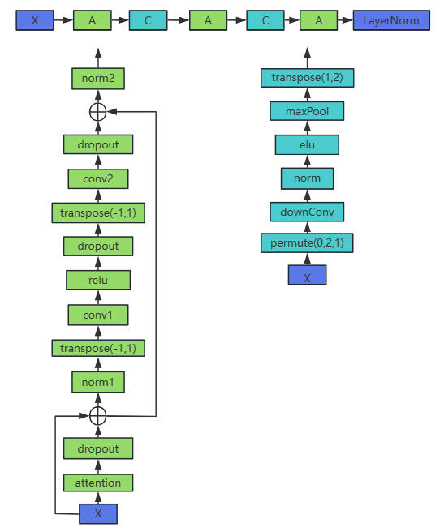

# Informer

## 背景及不足

许多实际应用需要长序列实际序列的预测，例如电力消耗计划

目前 Transformer 具有较强的长距离依赖能力，但传统的 Transformer 仍存在以下不足：

- Self-Attention 平方级的计算复杂度。
- 堆叠多层网络，内存占用瓶颈。
- step-by-step 解码预测，速度较慢。

## Informer 改进

- 提出 ProbSparse Self-Attention，筛选出最重要的 query，使复杂度降低到 $O(LlogL)$
- 提出 Self-Attention Distilling，减少维度和网络参数量。
- 提出 Generative Style Decoder，一步得到所有预测结果。

左图展示了与短期预测相比，LTSF 可以预测更长的序列；右图表明随着预测序列长度增加，从 $L=48$ 开始，MSE 迅速增大推理速度下降。

<figure markdown=span>  </figure>

## Informer 架构

<figure markdown=span>  </figure>

- Encoder 接受大量长序列输入。模型采用了 ProbSparse Self-Attention 代替了 Transformer 中的 Self-Attention。并且 Encoder 在堆叠时采用了 Self-Attention Distilling。
- Decoder 同样接受长序列输入，预测部分用 0 进行 padding。结果处理后直接输出所有预测结果。

### ProbSparse Self-Attention

传统 Self-Attention 需要 $O(L_QL_K)$ 的内存以及二次点积计算，是其主要缺点。本文研究发现，并不是每个 Q 与 K 之间都有很高的相关性（点积），故只有少数点积对主要注意力计算有贡献，其余可以忽略。

<figure markdown=span>  </figure>

改进算法如下：

- 输入序列长度为 96，首先在 K 中进行采样，随机选取 25 个 K。
- 计算每个 Q 与 25 个 K 的内积。
- 在每个 Q 的 25 个结果中，选择最大值与均值计算差异。
- 将差异从大到小排列，选出差异前 25 大的 Q。
- 其余淘汰的 Q 使用 V 的平均向量进行代替。

### Self-Attention Distilling

<figure markdown=span></figure>

## Encoder

<figure markdown=span></figure>

## 预处理（以 ETTh1 为例）

下图为数据示例，其中每个一小时收集一次变压器的

### Encoder 输入

$X_{enc}=[32,96,7]$，本文使用了 96 个历史样本，其中每个样本有 7 个特征。

$X_{mark}=[32,96,4]$，代表时间信息，将 date 拆分为年、月、日和小时。与上面的 $X_{enc}$ 对应得到所有样本对应的时间戳。

### Decoder 输入

$X_{dec}=[32,72,7]$

$X_{mark}=[32,72,4]$