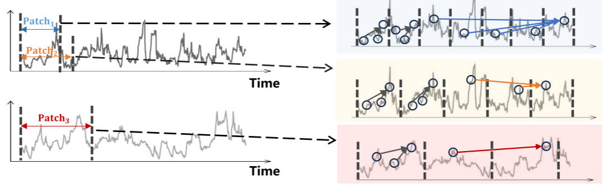
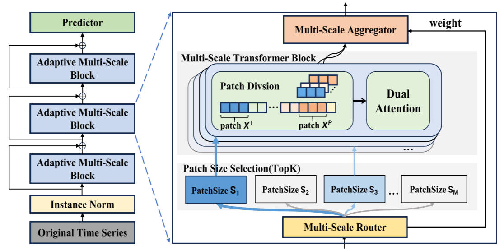
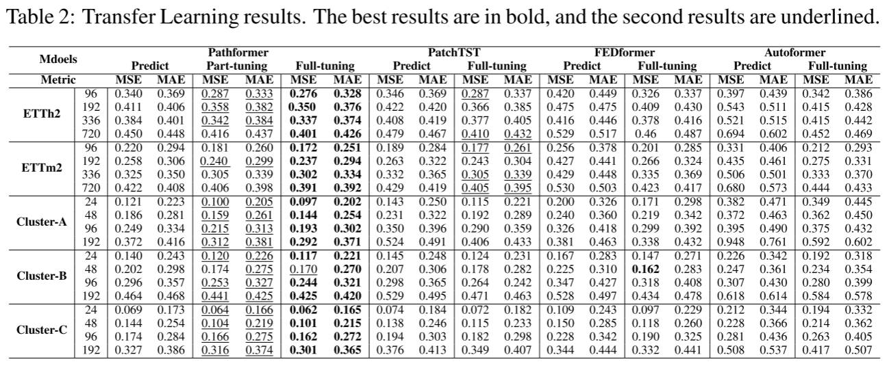
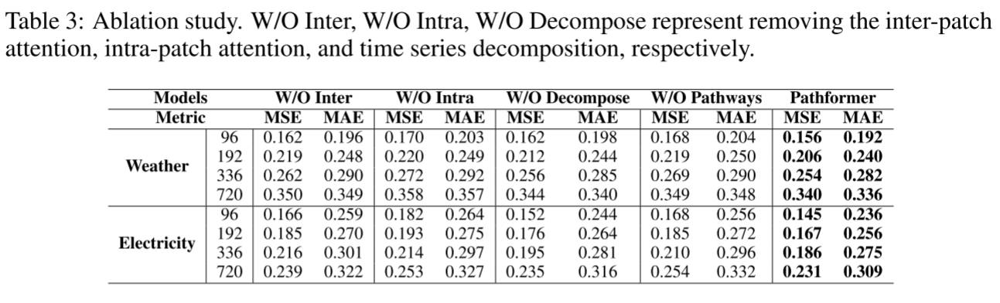

# Pathformer

## 研究问题

自适应多尺度 Transformer 时间序列预测

如何**有效地捕捉时间序列数据中的多尺度依赖关系**，从而提高预测的准确性和泛化能力。具体的挑战包括：

1. **捕捉跨尺度的时间依赖性**：传统的时间序列预测方法，如标准的Transformer，通常处理固定尺度的时间序列，这限制了它们在不同时间粒度上的建模能力。时间序列中可能包含短期的波动（如小时级别）和长期的趋势（如年度趋势），如何同时建模这两种依赖关系是一个关键问题。
2. **时间序列数据的多尺度建模**：如何设计一种方法能够在不同的时间尺度上对数据进行有效建模，并捕捉全局与局部的时间依赖性，尤其是在面对复杂和动态变化的时序数据时，如何处理输入数据的多变性和复杂性。
3. **自适应建模**：如何使得模型能够根据输入数据的不同动态变化自适应地调整多尺度建模过程，以提高其预测能力和泛化能力。

## 研究现状

在时序预测中，“尺度”（scale）通常指的是时间序列中数据的不同时间粒度或分辨率。具体来说，尺度可以从以下几个方面理解：

1. **时间粒度（Temporal Granularity）**：尺度可以指时间序列中数据的时间间隔。例如，如果你有按小时、按天或按分钟记录的数据，那么这些不同的时间间隔可以视为不同的尺度。在短期预测中，你可能关注分钟级别的数据，而在长期预测中，你可能关注的是天级或月级数据。
2. **时间依赖性（Temporal Dependency）**：时间序列中的某些模式可能在较短时间内发生变化（如季节性波动或日常变化），而其他模式可能需要较长时间来显现（如长期趋势）。因此，尺度也可以指的是捕捉不同时间跨度上依赖关系的能力。例如，短期尺度用于捕捉短期依赖关系（如每天的波动），而长期尺度用于捕捉长期依赖关系（如整体趋势）。
3. **多尺度建模**：在多尺度建模中，模型能够同时处理不同时间分辨率的数据，从而能够在不同的时间尺度上提取特征。这种方法能够更全面地捕捉时序数据的不同动态特性，如短期变化和长期趋势。例如，Pathformer通过将时间序列分为不同的时间尺度（如小时、天、周等），并使用不同尺度的注意力机制来建模全局与局部的依赖关系。

单尺度建模挑战：

- 无法捕捉多尺度的特征
- 短期与长期依赖关系难以平衡
- 泛化能力有限

## 创新点

- 多尺度建模，整合了时间分辨率和时间距离两个视角
- 自适应路径，由多尺度路由器与时间分解协同工作
- 双重注意力机制

<!-- <figure markdown=span>  </figure> -->

## 模型框架

<!-- <figure markdown=span>  </figure> -->

### 多尺度划分

为了简化符号表示，我们使用单变量时间序列进行描述，且该方法可以通过独立处理每个变量，轻松扩展到多变量情况。在多尺度 Transformer 模块中，我们定义一个包含 M 个补丁大小值的集合 $S = \{S_1, S_2, \dots, S_M\}$，其中每个补丁大小 S 对应一个补丁划分操作。对于输入时间序列 $X \in \mathbb{R}^{H \times d}$，其中 H 表示时间序列的长度，d 表示特征的维度，每个补丁划分操作以补丁大小 S 将 X 划分为 P 个补丁（其中 $P=H/S$），形式为 $(X_1, X_2, \dots, X_P)$，其中每个补丁 $X_i \in \mathbb{R}^{S \times d}$ 包含 S 个时间步。集合中的不同补丁大小将导致不同尺度的划分补丁，从而为输入序列提供不同的时间分辨率视角。这种多尺度划分与下面描述的双重注意力机制一起工作，用于多尺度建模。

<!-- <figure markdown=span> .jpg)</figure> -->

.jpg)

### 双重注意力

双重注意力机制包括了两部分：**补丁内注意力**，即在每个划分的补丁内进行的注意力操作；**补丁间注意力**，即跨不同补丁之间的注意力操作。 

**融合全局和局部信息**：为了融合通过双重注意力机制捕捉的全局和局部信息，我们对补丁内注意力的输出 $\text{Attn}_{intra}$ 进行重排，得到 $\text{Attn}_{intra} \in \mathbb{R}^{P \times S \times d_m}$，并通过线性变换将补丁大小从 1 变为 S，以合并每个补丁中的时间步。最终，将其与补丁间注意力 $\text{Attn}_{inter}$ 相加，得到双重注意力的最终输出：$\text{Attn} = \text{Attn}_{intra} + \text{Attn}_{inter}$

### 多尺度路由

**多尺度路由器（Multi-Scale Router）** 是多尺度 Transformer 中的一部分，用于数据自适应路由，选择最优的补丁大小，从而控制多尺度建模的过程。这个路由器结合了时间序列的周期性和趋势性分解，以提取时间序列中的周期性和趋势模式，具体过程如下：

1. **季节性分解（Seasonality Decomposition）**：
    - 傅里叶变换：首先将时间序列从时域转换到频域，使用 **Discern Fourier Transform（DFT）** 提取周期性模式： $X_{sea} = \text{IDFT}(\{f_1, \dots, f_{K_f}\}, A, \Phi)$ 其中，$\Phi$ 和 A 是傅里叶变换后的相位和幅度，
    ${f_1, \dots, f_{K_f}}$ 是幅度最大 $K_f$ 个频率成分。通过逆傅里叶变换得到周期性模式 $X_{sea}$。

2. **趋势性分解（Trend Decomposition）**：

    - 在季节性模式提取后，通过计算剩余部分 $X_{rem} = X - X_{sea}$，使用不同的平均池化核来提取趋势模式： $X_{trend} = \text{Softmax}(L(X_{rem})) \cdot \left(\text{AvgPool}(X_{rem})_{\text{kernel1}}, \dots, \text{AvgPool}(X_{rem})_{\text{kernelN}}\right)$ 其中，`AvgPool` 是池化函数，Softmax 处理池化结果的权重。

3. **融合季节性与趋势模式**：

    - 将季节性模式和趋势模式与原始输入 X 相加，进行线性映射 $\text{Linear}(·)$，得到融合后的表示 $X_{trans} \in \mathbb{R}^d$

4. **路由函数**：

    - 基于时间分解结果 $X_{trans}$，路由器使用路由函数来生成路径权重，决定当前数据选择的补丁大小： $R(X_{trans}) = \text{Softmax}(X_{trans} W_r + \epsilon \cdot \text{Softplus}(X_{trans} W_{noise})), \quad \epsilon \sim N(0, 1)$ 其中，$W_r$ 和 $W_{noise}$ 是可学习的参数，$\epsilon$ 是噪声项，用来引入随机性以避免总是选择相同的补丁大小。

5. **稀疏性和选择关键尺度**：

    - 为了鼓励选择关键尺度并引入稀疏性，路由函数使用 **top-K 选择** 来保留最重要的 K 个路径权重，并将其他路径权重设为 0，最终得到的路径权重表示为 $\bar{R}(X_{trans})$。

### 多尺度聚合

**多尺度聚合器（Multi-Scale Aggregator）** 是多尺度 Transformer 的一部分，用于将不同尺度的输出结合起来，生成最终的输出。该模块通过对每个补丁大小的路径权重进行加权聚合，从而实现对多尺度输出的综合。具体过程如下：

1. **路径权重 $\bar{R}(X_{trans})$**：
      - 每个路径权重 $\bar{R}(X_{trans})_i > 0$ 表示该补丁大小 $S_i$ 应该参与处理，进行补丁划分和双重注意力；如果 $\bar{R}(X_{trans})_i = 0$，则表示忽略该补丁大小。
2. **输出与变换**：
      - 对于每个补丁大小 $S_i$，输出 $X_i^{out}$ 是多尺度 Transformer 的结果。由于不同补丁大小产生的时间维度可能不同，聚合器首先应用一个变换函数 $T_i(\cdot)$ 来对齐不同尺度的时间维度。
3. **加权聚合**：
      - 聚合器根据路径权重对多尺度输出进行加权聚合，以得到最终的输出 $X_{out}$。聚合公式为：$X_{out} = \sum_{i=1}^{M} I(\bar{R}(X_{trans})_i > 0) \, \bar{R}(X_{trans})_i \, T_i(X_i^{out})$ 其中，$I(\bar{R}(X_{trans})_i > 0)$ 是指示函数，当 $\bar{R}(X_{trans})_i > 0$ 时输出 1，否则输出 0。这意味着在加权聚合时，只考虑具有正路径权重的补丁大小及其对应的 Transformer 输出。

## 实验结果

<!-- <figure markdown=span>  </figure> -->

<!-- <figure markdown=span>  </figure> -->

