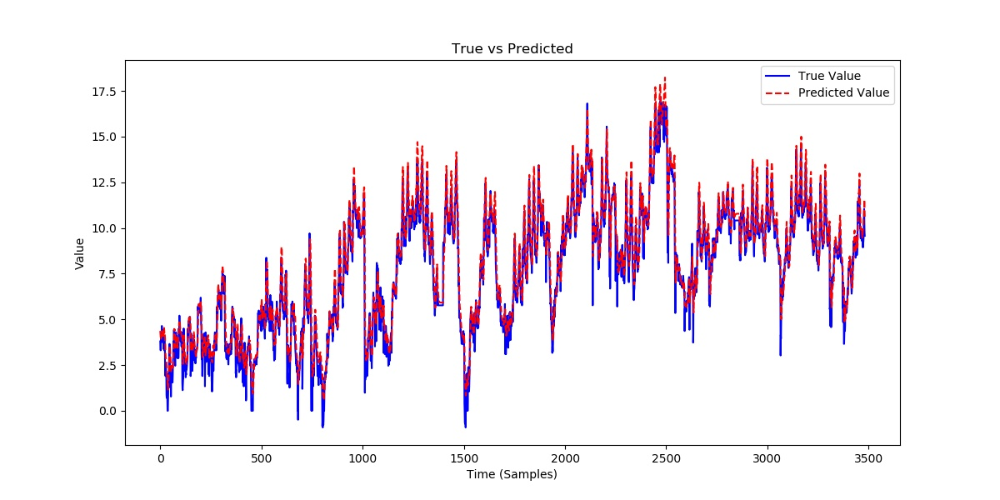
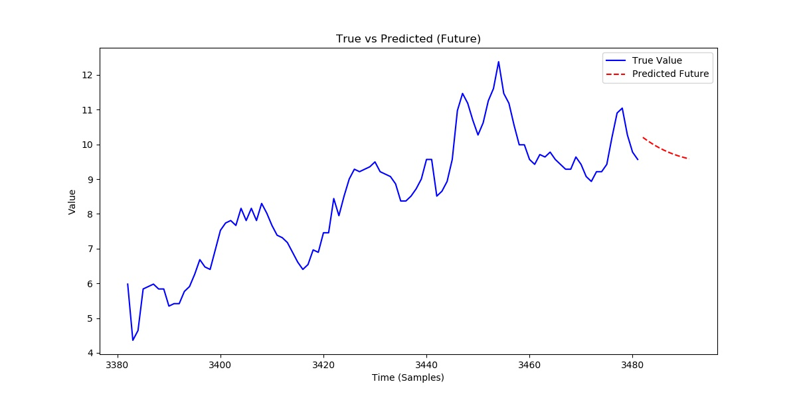

# 时间序列预测基础

## Conv1D

在时间序列中，Conv1D 通过滑动一个卷积核来提取局部特征，每次滑动时与输入数据的一个小块进行卷积运算。卷积的目的是提取数据中的局部模式，比如趋势、周期性变化等，常用于时间序列预测、异常检测等任务。

在 PyTorch 中，`Conv1d` 的输入和输出通常是一个三维张量，形状为：

$$
(batch\_size, channels, length)
$$

其中：

- $batch\_size$：每批数据的样本数量。
- $channels$：每个样本的通道数，对于一维时间序列数据通常是 1。如果是多通道数据（例如多个传感器的时间序列），则可以有多个通道。
- $length$：时间序列的长度，即每个通道上的数据点数。

卷积前后序列的长度变化为：

$$
L_{out} = \frac{L_{in} - K + 2P}{S} + 1
$$

在处理时间序列数据时，池化操作（如 Max Pooling 和 Average Pooling）也可以用来降低时间序列的维度，从而减少计算量并增强模型的鲁棒性。对于时间序列数据，池化操作通常是对时间步（即序列的长度）进行下采样，而不是对空间维度进行池化。池化输入输出形状和序列长度变化都与卷积相同。

## CNN+LSTM

### 数据处理

采用时间窗口将原始时间序列划分为若干固定长度的时间片段，每个时间片段用于预测未来的值。

假设原始序列为：$x_1,x_2,x_3,...,x_n$，窗口大小为 3，步长为 1，窗口生成的子序列：

- 输入：$[x_1,x_2,x_3],[x_2,x_3,x_4],...$
- 标签：$[x_4],[x_5],...$

时间大小包含过去 12 个时间步，步长为 1.

```python
def create_dataset(data, time_step=12):
    X, y = [], []
    for i in range(len(data) - time_step):
        X.append(data.iloc[i:i + time_step].values)
        y.append(data.iloc[i + time_step, -1])
    return np.array(X), np.array(y)


X, y = create_dataset(data, 12)
X_train, X_test, y_train, y_test = train_test_split(X, y, test_size=0.2, shuffle=False)
```

划分数据后，进行归一化。

```python
scaler = StandardScaler()
X_train_scaled = scaler.fit_transform(X_train.reshape(-1, X_train.shape[2])).reshape(X_train.shape)
X_test_scaled = scaler.transform(X_test.reshape(-1, X_test.shape[2])).reshape(X_test.shape)

scaler_y = StandardScaler()
y_train_scaled = scaler_y.fit_transform(y_train.reshape(-1, 1))
y_test_scaled = scaler_y.transform(y_test.reshape(-1, 1))

train_loader = DataLoader(
    TensorDataset(torch.tensor(X_train_scaled, dtype=torch.float32), torch.tensor(y_train_scaled, dtype=torch.float32)),
    batch_size=16, shuffle=True)
test_loader = DataLoader(
    TensorDataset(torch.tensor(X_test_scaled, dtype=torch.float32), torch.tensor(y_test_scaled, dtype=torch.float32)),
    batch_size=16, shuffle=False)
```

### 模型构建

`Conv1d`接受输入形状为$(batch\_size, channels, length)$，故需要先调整张量形状`x = x.permute(0, 2, 1)`。

```python
class CNN_LSTM(nn.Module):
    def __init__(self, input_size, hidden_size, output_size, dropout_rate=0.5):
        super(CNN_LSTM, self).__init__()
        self.conv1 = nn.Conv1d(input_size, 16, kernel_size=1)
        # self.conv2 = nn.Conv1d(16, input_size, kernel_size=1)
        self.relu = nn.ReLU()
        self.lstm = nn.LSTM(16, hidden_size, batch_first=True)
        self.dropout = nn.Dropout(dropout_rate)
        self.fc = nn.Linear(hidden_size, output_size)

    def forward(self, x):
        x = x.permute(0, 2, 1)
        x = self.relu(self.conv1(x))
        x = self.dropout(x)
        # x = self.relu(self.conv2(x))
        # x = self.dropout(x)
        x = x.permute(0, 2, 1)
        _, (hn, _) = self.lstm(x)
        return self.fc(hn[-1])


device = ("cuda" if torch.cuda.is_available() else "cpu")
# 训练
model = CNN_LSTM(input_size=7, hidden_size=2, output_size=1, dropout_rate=0.5).to(device)
criterion = nn.MSELoss()
optimizer = optim.Adam(model.parameters(), lr=0.001, weight_decay=1e-4)
```

### 训练与测试

```python
avg_train_loss = 0.0
for epoch in range(100):
    for X_batch, y_batch in train_loader:
        X_batch, y_batch = X_batch.to(device), y_batch.to(device)
        optimizer.zero_grad()
        output = model(X_batch)
        loss = criterion(output, y_batch)
        avg_train_loss += loss.item() * X_batch.size(0)
        loss.backward()
        optimizer.step()
    avg_train_loss /= len(train_loader)
    if epoch % 20 == 19:
        print(f"Epoch {epoch + 1}/100, Average Loss: {avg_train_loss:.4f}")

torch.save(model.state_dict(),'cnn_lstm.pth')
print("Model saved successfully.")

model = CNN_LSTM(input_size=7, hidden_size=1, output_size=1, dropout_rate=0.5).to(device)
model.load_state_dict(torch.load('cnn_lstm.pth'))
model.eval()
y_pred = []
y_true = []
test_loss = 0.0
with torch.no_grad():
    for X_batch, y_batch in test_loader:
        X_batch, y_batch = X_batch.to(device), y_batch.to(device)
        output = model(X_batch)
        loss = criterion(output, y_batch)
        test_loss += loss.item() * X_batch.size(0)
        y_pred.append(output.cpu().numpy())
        y_true.append(y_batch.cpu().numpy())
test_loss /= len(test_loader)
print(test_loss)

y_pred = np.concatenate(y_pred, axis=0)
y_true = np.concatenate(y_true, axis=0)

y_pred = scaler_y.inverse_transform(y_pred)
y_true = scaler_y.inverse_transform(y_true)

mse = mean_squared_error(y_true, y_pred)
mae = mean_absolute_error(y_true, y_pred)

print(f"Test MSE: {mse:.4f}")
print(f"Test MAE: {mae:.4f}")

plt.figure(figsize=(12, 6))
plt.plot(y_true, label='True Value', color='blue')
plt.plot(y_pred, label='Predicted Value', color='red', linestyle='--')
plt.title('True vs Predicted')
plt.xlabel('Time (Samples)')
plt.ylabel('Value')
plt.legend()
plt.savefig('ETTh1.jpg')
```

<figure markdown=span></figure>

### 使用时间窗口进行多步预测

每次预测一个时间步，并将结果作用与下一次。

```python
def predict_future(model, last_data, future_steps, scaler_y, device):
    model.eval()
    predictions = []
    current_input = torch.tensor(last_data, dtype=torch.float32).unsqueeze(0).to(
        device)  # shape (1, time_step, features)

    with torch.no_grad():
        for _ in range(future_steps):
            output = model(current_input)
            predicted_value = output.cpu().numpy()  # shape (1, 1)
            predictions.append(predicted_value)

            predicted_tensor = torch.tensor(predicted_value, dtype=torch.float32).unsqueeze(0).repeat(1, 1,current_input.size(-1)).to(device)
            current_input = torch.cat((current_input[:, 1:, :], predicted_tensor), dim=1)

    predictions = np.array(predictions).squeeze()  # 去掉多余的维度
    return scaler_y.inverse_transform(predictions)  # 转换回原始的尺度


future_steps = 10
last_test_data = X_test_scaled[-1]  # 最后一条测试数据作为起点
predicted_future = predict_future(model, last_test_data, future_steps, scaler_y, device)
```

<figure markdown=span></figure>

### CNN_LSTM.py

```python
import pandas as pd
import numpy as np
import torch
import torch.nn as nn
import torch.optim as optim
from torch.utils.data import DataLoader, TensorDataset
from sklearn.preprocessing import StandardScaler
from sklearn.model_selection import train_test_split
import matplotlib.pyplot as plt
from sklearn.metrics import mean_squared_error, mean_absolute_error

# def extract_time_features(df):
#     df['date'] = pd.to_datetime(df['date'])
#     df['year'] = df['date'].dt.year
#     df['month'] = df['date'].dt.month
#     df['day'] = df['date'].dt.day
#     df['weekday'] = df['date'].dt.weekday
#
#     df = df.drop(columns=['date'])
#     return df


# 数据加载与预处理
data = pd.read_csv("ETTh1.csv").drop(columns=['date'])


# data = extract_time_features(data)

# print(data.head())


def create_dataset(data, time_step=12):
    X, y = [], []
    for i in range(len(data) - time_step):
        X.append(data.iloc[i:i + time_step].values)
        y.append(data.iloc[i + time_step, -1])
    return np.array(X), np.array(y)


X, y = create_dataset(data, 12)
X_train, X_test, y_train, y_test = train_test_split(X, y, test_size=0.2, shuffle=False)


scaler = StandardScaler()
X_train_scaled = scaler.fit_transform(X_train.reshape(-1, X_train.shape[2])).reshape(X_train.shape)
X_test_scaled = scaler.transform(X_test.reshape(-1, X_test.shape[2])).reshape(X_test.shape)

scaler_y = StandardScaler()
y_train_scaled = scaler_y.fit_transform(y_train.reshape(-1, 1))
y_test_scaled = scaler_y.transform(y_test.reshape(-1, 1))

train_loader = DataLoader(
    TensorDataset(torch.tensor(X_train_scaled, dtype=torch.float32), torch.tensor(y_train_scaled, dtype=torch.float32)),
    batch_size=16, shuffle=True)
test_loader = DataLoader(
    TensorDataset(torch.tensor(X_test_scaled, dtype=torch.float32), torch.tensor(y_test_scaled, dtype=torch.float32)),
    batch_size=16, shuffle=False)


# 模型定义
class CNN_LSTM(nn.Module):
    def __init__(self, input_size, hidden_size, output_size, dropout_rate=0.5):
        super(CNN_LSTM, self).__init__()
        self.conv1 = nn.Conv1d(input_size, 16, kernel_size=1)
        # self.conv2 = nn.Conv1d(16, input_size, kernel_size=1)
        self.relu = nn.ReLU()
        self.lstm = nn.LSTM(16, hidden_size, batch_first=True)
        self.dropout = nn.Dropout(dropout_rate)
        self.fc = nn.Linear(hidden_size, output_size)

    def forward(self, x):
        x = x.permute(0, 2, 1)
        x = self.relu(self.conv1(x))
        x = self.dropout(x)
        # x = self.relu(self.conv2(x))
        # x = self.dropout(x)
        x = x.permute(0, 2, 1)
        _, (hn, _) = self.lstm(x)
        return self.fc(hn[-1])


device = ("cuda" if torch.cuda.is_available() else "cpu")
# 训练
model = CNN_LSTM(input_size=7, hidden_size=1, output_size=1, dropout_rate=0.5).to(device)
criterion = nn.MSELoss()
optimizer = optim.Adam(model.parameters(), lr=0.001, weight_decay=1e-4)

avg_train_loss = 0.0
for epoch in range(100):
    for X_batch, y_batch in train_loader:
        X_batch, y_batch = X_batch.to(device), y_batch.to(device)
        optimizer.zero_grad()
        output = model(X_batch)
        loss = criterion(output, y_batch)
        avg_train_loss += loss.item() * X_batch.size(0)
        loss.backward()
        optimizer.step()
    avg_train_loss /= len(train_loader)
    if epoch % 20 == 19:
        print(f"Epoch {epoch + 1}/100, Average Loss: {avg_train_loss:.4f}")

torch.save(model.state_dict(),'cnn_lstm.pth')
print("Model saved successfully.")

model = CNN_LSTM(input_size=7, hidden_size=1, output_size=1, dropout_rate=0.5).to(device)
model.load_state_dict(torch.load('cnn_lstm.pth'))
model.eval()
y_pred = []
y_true = []
test_loss = 0.0
with torch.no_grad():
    for X_batch, y_batch in test_loader:
        X_batch, y_batch = X_batch.to(device), y_batch.to(device)
        output = model(X_batch)
        loss = criterion(output, y_batch)
        test_loss += loss.item() * X_batch.size(0)
        y_pred.append(output.cpu().numpy())
        y_true.append(y_batch.cpu().numpy())
test_loss /= len(test_loader)
print(test_loss)

y_pred = np.concatenate(y_pred, axis=0)
y_true = np.concatenate(y_true, axis=0)

y_pred = scaler_y.inverse_transform(y_pred)
y_true = scaler_y.inverse_transform(y_true)

mse = mean_squared_error(y_true, y_pred)
mae = mean_absolute_error(y_true, y_pred)

print(f"Test MSE: {mse:.4f}")
print(f"Test MAE: {mae:.4f}")

plt.figure(figsize=(12, 6))
plt.plot(y_true, label='True Value', color='blue')
plt.plot(y_pred, label='Predicted Value', color='red', linestyle='--')
plt.title('True vs Predicted')
plt.xlabel('Time (Samples)')
plt.ylabel('Value')
plt.legend()
plt.savefig('ETTh1.jpg')


def predict_future(model, last_data, future_steps, scaler_y, device):
    model.eval()
    predictions = []
    current_input = torch.tensor(last_data, dtype=torch.float32).unsqueeze(0).to(
        device)  # shape (1, time_step, features)

    with torch.no_grad():
        for _ in range(future_steps):
            output = model(current_input)
            predicted_value = output.cpu().numpy()  # shape (1, 1)
            predictions.append(predicted_value)

            predicted_tensor = torch.tensor(predicted_value, dtype=torch.float32).unsqueeze(0).repeat(1, 1,
                                                                                                      current_input.size(-1)).to(device)
            current_input = torch.cat((current_input[:, 1:, :], predicted_tensor), dim=1)

    predictions = np.array(predictions).squeeze()  # 去掉多余的维度
    return scaler_y.inverse_transform(predictions)  # 转换回原始的尺度


future_steps = 10
last_test_data = X_test_scaled[-1]  # 最后一条测试数据作为起点
predicted_future = predict_future(model, last_test_data, future_steps, scaler_y, device)

plt.figure(figsize=(12, 6))

# 绘制历史值
n = 100  # 显示真实值的最后n个点
plt.plot(np.arange(len(y_true) - n, len(y_true)), y_true[-n:], label='True Value', color='blue')
plt.plot(np.arange(len(y_true), len(y_true) + len(predicted_future)), predicted_future, label='Predicted Future', color='red', linestyle='--')
plt.title('True vs Predicted (Future)')
plt.xlabel('Time (Samples)')
plt.ylabel('Value')
plt.legend()
plt.savefig('ETTh1_partial_true_future.jpg')

```